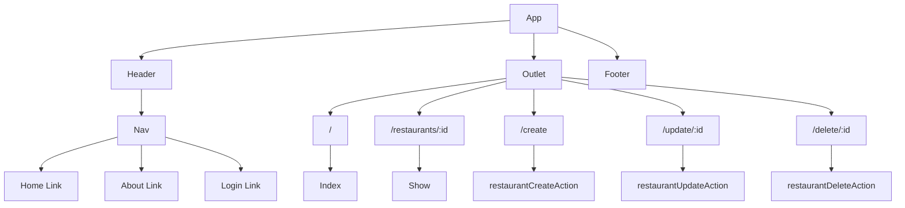

# Taste Tracker

“Taste Tracker” is a frontend React application that allows users to view, create, delete, and update their favorite restaurants. The app features user authentication, ensuring that only authorized users can access and manipulate restaurant information. The user interface is intuitive and easy to navigate, allowing users to quickly and efficiently manage their restaurants. Additionally, the application integrates with a backend service to securely store and retrieve restaurant data. Overall, “Taste Tracker” is a powerful and user-friendly tool for managing a users favorite restaurants.

### Technologies used
- React
- react-router-dom
  
## Component Architecture

### Frontend Route Table
|    Route         | Element |    Loader        |       Action           |              Description                          |
|------------------|---------|------------------|------------------------|---------------------------------------------------|
|      /           | Index   | indexLoader      |                        | Loads up list of restaurants                      |
| /restaurants/:id | Show    | restaurantLoader |                        | Loads up a specific restaurant                    |
|   /create        | Create  |                  | restaurantCreateAction | Handles submission of create form for restaurants |
| /update/:id      | Update  |                  | restaurantUpdateAction | Handles submission of update form for restaurants |
| /delete/:id      | Delete  |                  | restaurantDeleteAction | Handles submission of delete form for restaurants |

## Mockups

### Desktop Mockup

### Tablet Mockup

### Mobile Mockup

[Trello Board](https://trello.com/invite/b/6pOwOeN3/ATTId64f84a70cf965a60210110df4b5547e0D3ED910/workspace) 

[Deployed Website]() 